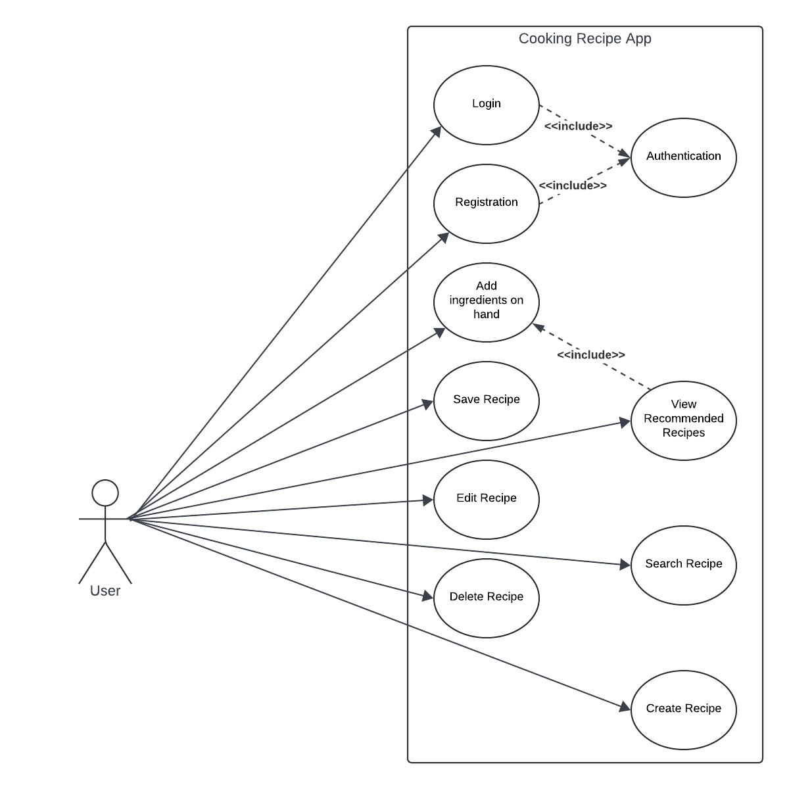

```
Introduction to Software Engineering - CIS 350
```

<p align="center">
    
</p>

### Department: Computer Science

### Cooking Recipe App (Need new name)

### Made by:
---
### Michael Presson
### Son Nguyen
### Mason Passinault
---
## 1 Abstract
Add abstract here...

## 2 Introduction
Add Intro here...

## 3 Architectural Design
Design elements here...

## 3.1 Use Case Diagram
<p align="center">
    
</p>

## 3.2 Class Diagram
Class Diagram here...

## 3.3 Sequence Diagram
Sequence Diagram here...

## Demo
<p alight="center">
    

