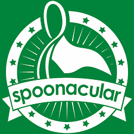

```
Introduction to Software Engineering - CIS 350
```

<p align="center">
    
</p>

### Department: Computer Science

### CodedCuisine: An Ingredient-Based Recipe Finder

### Made by:
---
### Michael Presson
### Son Nguyen
### Mason Passinault
---
## 1 Abstract
Meal preparation often involves combining specific ingredients to create familiar dishes. However, many people buy groceries without a clear meal plan, leading to unused produce and potential food waste. Traditional recipe searches may not account for the ingredients on hand and often suggest dishes that require additional ingredients or leave out ingredients entirely.
Our website tool addresses this issue by allowing users to input the ingredients they have available then instantly generate a variety of recipes. By offering recipes based on available ingredients, CodedCuisine provides a solution for efficient meal planning. Users can quickly access a variety of recipe options that cater to their needs and preferences, all while making the most of their ingredients on hand.


## 2 Introduction
Cooking at home is a valuable skill in today's society, offering both health benefits and cost savings. However, the challenge often lies not in the cooking itself, but in the meal planning process. Most people are not professional chefs with extensive knowledge of diverse dishes, making it difficult to creatively utilize the available ingredients to create a well rounded meal.

This common struggle inspired the creation of CodedCuisine. Our web-based tool is designed to simplify meal planning and recipe search. Our decision to create a website, rather than an Android/IOS application, comes from our goal to provide accessibility and convenience to our users. 

A website can be accessible virtually from any device with a browser, eliminating the need to install an application and allows our tool to be used on all platforms and operating systems. This allows for instant updates, ensuring that all users have the latest feature without any actions.
CodedCuisine utilizes the MERN (MongoDB, React, Node.js) stack and an external food recipe API as the foundation for our web-based tool. 


## 3 Architectural Design
CodedCuisine is built on a client-server architecture that enables users to interact with our recipe finder. The client side consists of a web browser interface, while the server side manages an external API and database. When a user searches for a recipe, our server processes the request, querying both the database and the food recipe API to generate a list of recommended recipes.

<p align="center">
    
</p>
<p align="center"> Figure 1: Client Server Architecture of CodeCuisine </p>


## 3.1 Database
CodedCuisine utilizes MongoDB database to query the list of ingredients. Figure 1 shows a list of ingredients queried from the user input.  

<p align="center">
    
</p>
<p align="center"> Figure 2: MongoDB Ingredients </p>

## 3.12 Server
CodedCuisine utilizes React for the user-interface on the client side while Node.js to process the server side. This process the clients request and manages the logic to retrieve the recommended recipes.  

<p align="center">
    
</p>
<p align="center"> Figure 3: React.js and Node.js </p>


## 3.13 Spoonacular Recipe API
CodedCuisine utilizes the Spoonacular API, a food and recipe database, to gain access to thousands of recipes. This integration allows our application to query the MongoDB and Spoonacular API using the user input to generate the recommended recipes. 
<p align="center">
    
</p>
<p align="center"> Figure 4: Spoonacular API</p>


## 3.2 Use Case Diagram
<p align="center">
    
</p>
<p align="center"> Figure 5: Use Case Diagram</p>

## 3.3 Class Diagram
<p align="center">
    
</p>
<p align="center"> Figure 6: Class Diagram</p>

## 3.4 Sequence Diagram
<p align="center">
    
</p>
<p align="center"> Figure 7: Sequence Diagram</p>


## 3.5 Communication Diagram
<p align="center">
    
</p>
<p align="center"> Figure 8: Communication Diagram</p>

## User Guide

The users can access the application from any device with a web browser and internet connection. To begin, open the preferred web browser and navigate to "CodedCuisine.com". Upon arrival, the user will be greeted with the main dashboard shown in Figure X. The dashboard features a simple UI input field with “Add Item” and “Clear” buttons. Once the user adds the desired ingredients, they can click the “Search” button to query the recommended recipes. The result will be displayed below the input field. 

<p align="center">
    
</p>
<p align="center"> Figure 9: Dashboard and Search Function </p>

## 4 Risk Analysis

CodedCuisine faces several potential risks for our operation. We rely heavily on the MongoDB and Spoonacular API for search queries. As a startup, we’ve opted for the lower tier subscription of both services, which may lead to downtime during unexpected high traffic that could affect the user experience. This scalability issue is the primary potential risk to our operation. 

Another risk we face is the accuracy of the recipe recommendation. While our goal is to provide users with precise recommendations based on their available ingredients, there’s a small possibility that our program and Spoonacular API may produce inaccurate results. However, we understand that this risk is minor compared to the potential downtime of MongoDB and Spoonacular API. Users will still be able to see the recipes but have minor inconvenience to their searching process. 

We anticipate these risks to be manageable in the short term and we will upgrade tier based on traffic data prediction.


## Retrospective
We were able to utilize the MERN stack effectively and integrated the Spoonacular API. However, our team faced some challenges early on during the planning phase of our software development. We were conflicted on the direction of the architectural design, features, and whether to deploy CodedCuisine via an App or Web-based which caused some delays. While we did implement JIRA for task management, our inexperience with the tool led to inefficiencies and delays. These early setbacks caused delays in our API integration and testing overall. We learned that user feedback/testing is vital throughout every step of the development and we should’ve incorporated it sooner. 


## Future Scope
Due to time and budget constraints, CodeCuisine in its current form does not have the most efficient performance and availability. Our future plan includes migrating our server from a local hosting to a cloud-based hosting such as Amazon AWS. This will improve our scalability issue and provide consistent runtime. In addition, we plan to integrate and deploy our software on a custom domain, preferably “CodedCuisine.com” to market ourself more competitively.

## Demo
<p>
    <a href="https://drive.google.com/file/d/1Xy14rUIoqP_aWw97gUhOVttsr91WT2d0/view?usp=sharing">
        
    Click here for full demonstration.</a>
</p>

